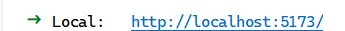
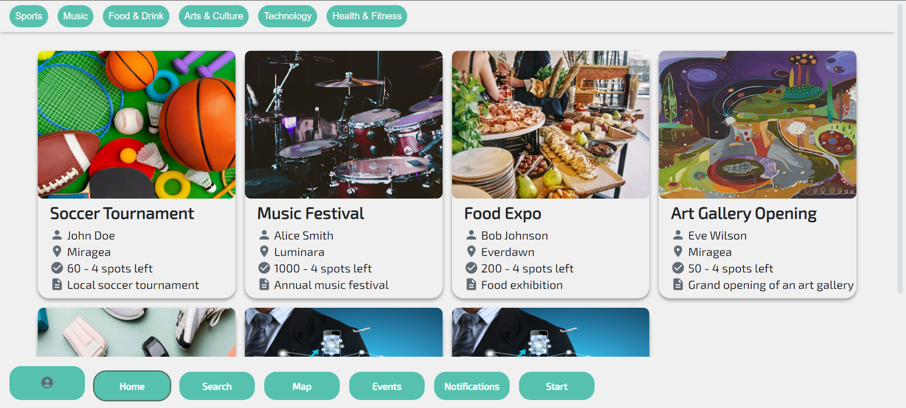
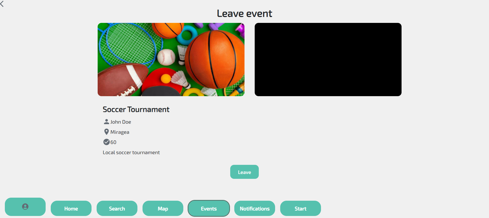
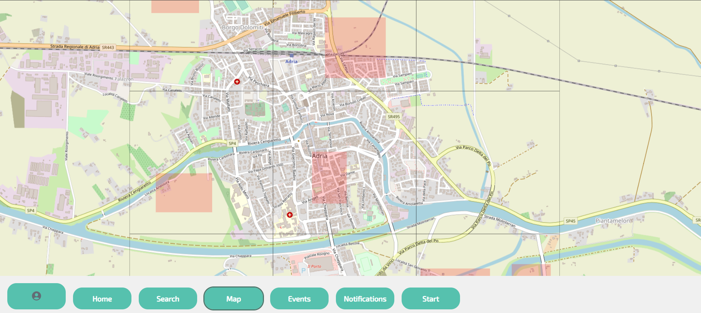

# ADRIACTIVE - Group project howest

## Introduction

AdriActive is an event app that lets the people of Adria plan and create events on safe zones. No more worrying about
going out in the dangerous weather of Adria. Everyone can go be social again.

## Demonstration


- If the video doesn't load -> https://youtu.be/Tre63Rwlmrk

## Using the Software

### Prerequisites

For this app you will need to have a gitlab account and download the three files inside this link:

https://gitlab.ti.howest.be/ti/2023-2024/s3/analysis-and-development-project/projects/group-10

You will need IDE's to run these files. One to open the Java in 'server' like Intellij, and one for the React.js in the
client like Webstorm or Vscode.

For 'client' you have to first write the following command in the command line of the IDE:

```bash
pnpm install
```

Next step is to run the server in Intellij. The way to do this is to press the RUN icon top-right of the IDE.

Now you can go over to Webstorm for the client side and you can simple run this command in the command line:

```bash
pnpm run dev
```

Now in the command line you should see a link that looks like this:



Click the link and this should take you to the default browser that Webstorm chooses for you.

If everything went right you should be able to see the webpage and ready to work with the application!

### Usage

Now you will get to see a description of what each webpage does!

#### Home

On the home page of our app you will see all the events that can be joined.



Clicking on one of those events will take you to the join events page where you can join the chosen event by simply clicking the 'Join' button.



#### Map

On the map page you can check out which places in Adria aren't safe to go out on because of natural hazards.



The red rectangles represent the dangerous area's on which you CAN'T plan an event.

## SonarQube

## Understanding the Documentation Respository

### Technical Documents

#### ERD

https://lucid.app/lucidchart/c35d45de-603c-4fe4-a6be-f0577fcdde2c/edit?viewport_loc=-1202%2C-741%2C3076%2C1260%2C0_0&invitationId=inv_c729a94d-a9c3-40e7-b7a7-bb50dc215eab

#### C4

https://lucid.app/lucidchart/abc6941e-7c77-47e7-8c2e-e3879741ee83/edit?invitationId=inv_fd397eff-c6d3-4c9b-9c26-8eaf1c1d2717&page=0_0#

#### Flowcharts

https://lucid.app/lucidchart/06bb5377-395f-4537-b2b1-819fe48bded1/edit?invitationId=inv_aad83510-d29f-4cd5-a48f-059d173c3c89&page=0_0#

### Business Case

https://docs.google.com/document/d/1oM3baoAAKNYITUt2cgNTrUJwuQqr5x4IsmT-ZmMTMlw/edit?usp=sharing

### UCD

https://lucid.app/lucidchart/edb21ecb-f9e2-47b3-a81c-65adcdf042fb/edit?viewport_loc=934%2C564%2C3172%2C1555%2C0_0&invitationId=inv_3bd20acd-3a15-42da-9608-c81ddc0d6636

## Implemented Topics

### Self-study Topics

-   React.js
-   Push notifications
-   Vibration API

## Class Taught Topics

-   Ol Maps
-   Websockets

# OpenAPI

The endpoint returns all future events

-   /api/public/event
-   https://project-2.ti.howest.be/2023-2024/group-10/api/public/event
